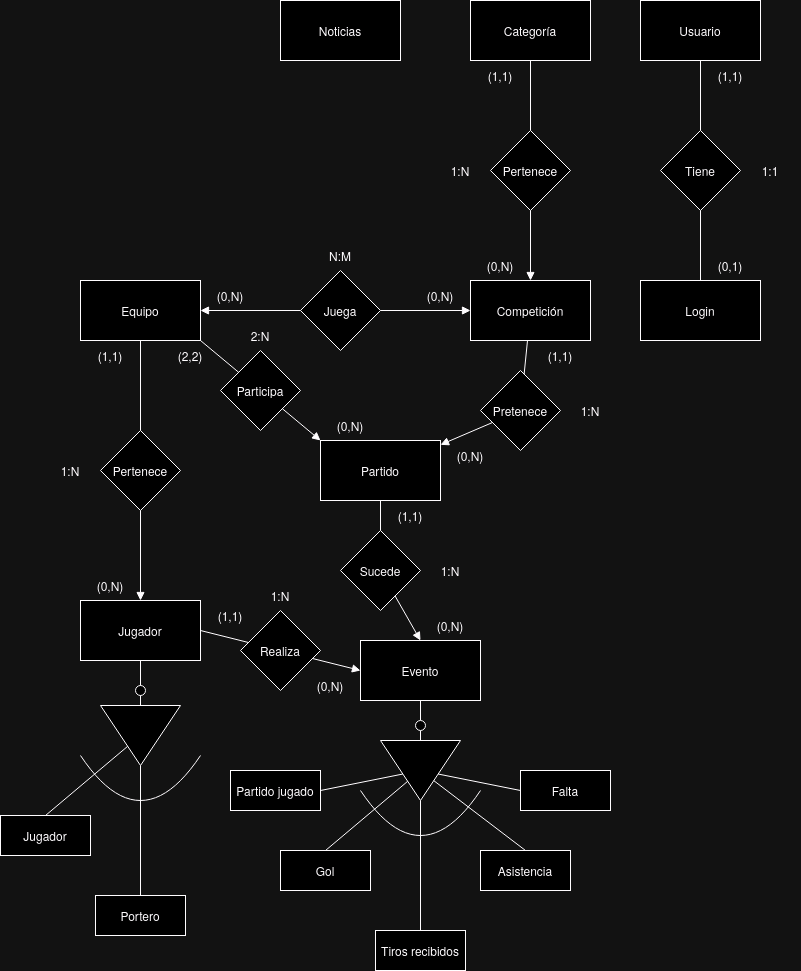

# Base de datos

Se ha desarrollado una base de datos teniendo en cuenta los requisitos de la
aplicación con el primer funcional desarrollado después de hablar con el
cliente. Esto incluye un [Modelo E/R](#modelo-er) para poder determinar las
relaciones entre todas las entidades, y un
[Modelo relacional](#modelo-relacional) en el que se determina el diseño final
de la base de datos traduciendo el modelo E/R a tablas y añadiendo los campos a estas.

## Modelos

### [Modelo E/R](./design/diagramaERCochinillos.drawio)

Este modelo se ha desarrollado para observar las relaciones de manera sencilla
entre todas las entidades. Empezando con las más sencillas, la entidad
**"Entrada"** no tiene relación ninguna ya que esta solo representa
las noticias que aparecerán en el blog de la aplicación, así mismo, la entidad
**"Usuario"** tampoco tiene relaciones ya que solo se utilizará para que los
visitantes de la web se subscriban a un servicio de notificación mediante
correos electrónicos de las noticias y futuros eventos.

Después, las entidades más relacionadas empiezan por **"Competición"**, que
representa las competiciones que se llevarán
a cabo separadas por **"Categorías"** a las deben pertenecer los **"Equipos"**
que participen. Dentro de estos **"Equipos"** se encuentran los **"Jugadores"**
de la plantilla. Y para conseguir las estadísticas se han creado los
**"Partidos"** que se llevarán a cabo en las **"Competiciones"** entre dos
**"Equipos"**, y dentro de estos partidos ocurrirán diferentes
**"Eventos"** que estarán relacionados con ciertos **"Jugadores"**.

    

### [Modelo relacional](https://dbdesigner.page.link/EctTiUCBiYPVZTbQA)

El modelo relacional lo he desarrollado mediante la herramienta ["DB designer"](https://erd.dbdesigner.net).
Y muestra las siguientes tablas:

- **Usuario.** Lo único que necesitamos es su nombre para mostrarlo, el email al
    que enviar los correos y si es admin para que pueda subir entradas al blog.
- **Blog.** En este insertaremos todas las entradas que dispondrán de un título,
    una descripción, una imágen y la fecha en la que se subió.
- **Competición.** Guardaremos el nombre que se mostrará de esta las fechas
    entre las que se celebra y a qué categoría pertenece.
- **CompeticionEquipo.** Utilizaremos esta tabla para relacionar a todos los
    equipos con las competiciones que se llevan a cabo.
- **Equipo.** En la que guardaremos su nombre, el lugar al que pertenece y su categoría.
- **Categoría.** Simplemente se guarda el nombre que se mostrará en la página.
- **Partido.** Se guardará la fecha en el que se discutió, el lugar, a que
    competición pertenece y los dos equipos que jugaron entre ellos.
- **Jugador.** Necesitamos su número, nombre, los dos apellidos, su fecha de
    nacimiento para poder mostrar su edad, una foto de este y al equipo al que pertenece.
- **Evento.** Estos serán acciones que pueden suceder en un partido, serán de un
    tipo de la tabla de tipos, estará relacionado con un jugador y
    guardaremos el partido en el que ha sucedido. Además, dependiendo del tipo
    se usará el minuto y el valor de diferente manera, en "partido jugado" será
    "null", en "gol" se apuntará el minuto en el que sucedió, en "tiros recibidos"
    será el número de tiros que ha recibido el portero apuntado en el valor, en "asistencia"
    será el id del evento tipo "gol" al que ha asistido en el valor y en "falta"
    será el minuto en el que ha sucedido y el valor los minutos que ha sido expulsado.
- **Tipo.** En esta se guardaran los diferentes tipos de eventos que pueden
    suceder en un partido.

    

